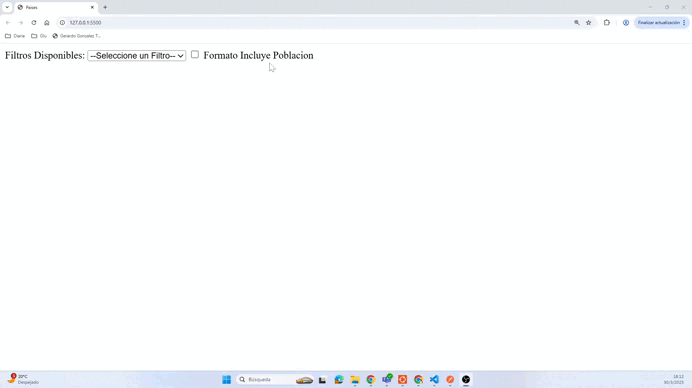

# Filtros Mundiales

El siguiente es un código JavaScript simple que está embebido en el archivo index.html y que, además, incluye otro archivo llamado paises.js, el cual contiene una única clase que consume una [api externa](https://restcountries.com/v3.1/all) y gestiona los filtros enviados desde el HTML.

## Objetivo

El objetivo de este ejercicio es que tomen contacto con JavaScript y comprendan el concepto de función como objeto de primera clase. Esto significa que las funciones son tratadas como datos y, en consecuencia, pueden ser pasadas como parámetros, almacenadas en variables y devueltas como resultados.

## Requerimientos

Agregar tres filtros adicionales:

- **Países superpoblados**: aquellos cuya población es mayor a 100.000.000 de habitantes.

- **Países insulares**: aquellos que son islas, es decir, no tienen fronteras (borders).

- **Países de habla guaraní**: aquellos que incluyen el Guaraní entre sus idiomas.

## Demo De como debería quedar

